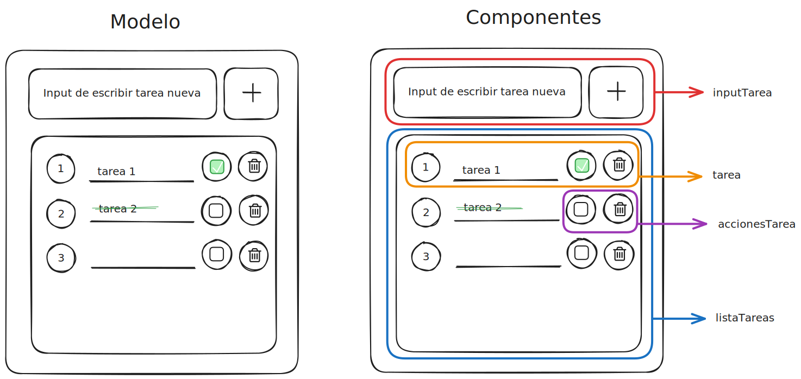

<body style= "font-family: Arial, Helvetica, sans-serif;">

<h1 style="text-align: center; color: #ffb563;"><ins>ToDo List</ins></h1>

Vamos a mostrar paso a paso como crear una ToDo List con React. Comentaremos los components, pages, props, eventos y todo lo necesario para la reactividad.

<h3 style="color: #ffb563">Paso 1 - Separando los components</h3>

Crear con Excalidraw el modelo de la página que queremos y separar sus componentes

En este caso vamos a necesitar crear 4 components:

> 1. inputTarea que contiene:
>
>       * Un input donde el usuarios escribe la tarea que quiere agregar a la lista
>
>       * Un button que al hacer clic agrega la tarea que el usuario escribió en el input
>
> 2. listaTarea que es una lista de tareas ul contiene:
>
>       * Las tareas que son de tipo (li) y sus acciones (un checkbox y un botón)
>
> 3. tarea que es un li que contiene:
>
>       * Un span que es el texto de la tarea y sus acciones (un checkbox y un botón)
>
> 4. accionesTarea que contiene:
>
>       * Un input de tipo checkbox para marcar cuando la tarea está hecha
>
>       * Un button que servirá para eliminar la tarea

<h3 style="color: #ffb563">Paso 2 - Creando carpetas de los components</h3>

Debemos crear dentro de src una carpeta llamada components donde tendremos varias carpetas con los componentes de la ToDo List.

Cada una de esas carpetas contiene un archivo jsx y uno css

<h3 style="color: #ffb563">Paso 3 - Creando carpeta pages</h3>

La carpeta pages contiene cada una de las carpetas de las páginas de nuestra web.

En este caso vamos a crear una única carpeta dentro que será la listaTareas

<h3 style="color: #ffb563">Paso 4 - HTML y CSS de cada componente</h3>

Lo primero es crear todo lo visual (HTML y CSS).

<h3 style="color: #ffb563">Paso 5 - Reactividad y relaciones</h3>

Una vez tengamos todo creado en HTML y CSS, debemos ocuparnos de la reactividad y la relación padre-hijo e hijo-padre para que reciban información, hagan cambios, etc...

* <h4 style="color: #ffb563">inputTarea</h4>

* <h4 style="color: #ffb563">listaTarea</h4>

* <h4 style="color: #ffb563">tarea</h4>

* <h4 style="color: #ffb563">accionesTarea</h4>

</body>