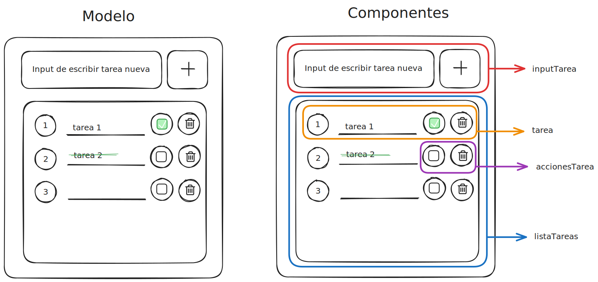

# Creando lista ToDo

En la clase2 teníamos como objetivo crear una lista ToDO utilizando React.  
Acceder a ***1. Resumenes > 6. React > Clase2*** paa ver el proyecto.

## Datos importantes para crear cualquier proyecto:

1. Todo lo que querramos crear debe ir dentro de la carpeta **src**

2. Dentro de src debemos crear una carpeta llamada **components** donde tendremos separado por módulos (que serán carpetas) cada parte de la web. Por ejemplo: navbar, footer, articulo...

3. Cada uno de los módulos deberá contener POR LO MENOS 2 archivos dentro:
    > .jsx - donde trabajaremos la parte de JS y HTML de ese módulo
    >
    > .css  - donde trabajaremos la parte de css de ese módulo

## Modelo de la lista que vamos a utilizar en este ejercicio:

Para crear proyectos así, utilizamos: **https://excalidraw.com/**