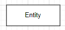
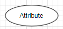
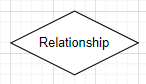

<body style= "font-family: Arial, Helvetica, sans-serif;">

<h1 style="text-align: center; color: #ffb563;"><ins>Introducción a SQL</ins></h1>

<h2 style="color: #ffb563;">Qué es mySQL?</h2>

Es uno de los sistemas de gestión de base de datos más utilizado en el mundo.

<h2 style="color: #ffb563;">Qué es una base de datos?</h2>

Es un conjunto de información organizado de manera que pueda ser utilizada eficientemente.

<h2 style="color: #ffb563;">Modelo Entidad Relación</h2>

Es un diagrama que permite representar las entidades relevantes de un sistema de información y sus relaciones y propiedades.

<h3 style="color: #ffb563;"><ins>Elementos:</ins></h3>

* <h4 style="color: #ffb563;">Entidades</h4>
    
Representan cosas u objetos (reales o abstractos), que se diferencian entre si.

    
Se representan por un rectángulo:

    </img>

* <h4 style="color: #ffb563;">Atributos</h4>
    
Definen o identifican características de la entidad (es el contenido de la entidad).

    
Se representan por un elipse:

    </img>

* <h4 style="color: #ffb563;">Relación</h4>
    
Describen la dependencia entre entidades o permite la asiciación de las mismas.

    
Se representan por un rombo:

    </img>

<h5 style="color: #ffb563;">Ejemplo de un diagrama:</h5>

</img>

<h2 style="color: #ffb563;">Correspondencia de cardinalidad</h2>

Indica el número de entidades con las que puede estar relacionada una entidad dada

<h3 style="color: #ffb563;"><ins>Tipos:</ins></h3>

* <h4 style="color: #ffb563;">Uno a Uno (1:1)</h4>
    
Un registro de la entidad A se relaciona con solo un registro de la entidad B.

* <h4 style="color: #ffb563;">Uno a Varios (1:N)</h4>
    
Un registro de la entidad A se relaciona con cero o muchos registros de la entidad B. Pero los registros de B solamente se relacionan con un registro de A.

* <h4 style="color: #ffb563;">Varios a Uno (N:1)</h4>
    
La entidad A se relaciona exclusivamente con la entidad B. Pero B se puede relacionar con 0 o muchos registros en A

* <h4 style="color: #ffb563;">Varios a Varios (N:M)</h4>
    
La entidad A se puede relacionar con 0 o muchos registros de la entidad B y viceversa.

<h2 style="color: #ffb563;">Pasando el modelo a tablas</h2>

</body>